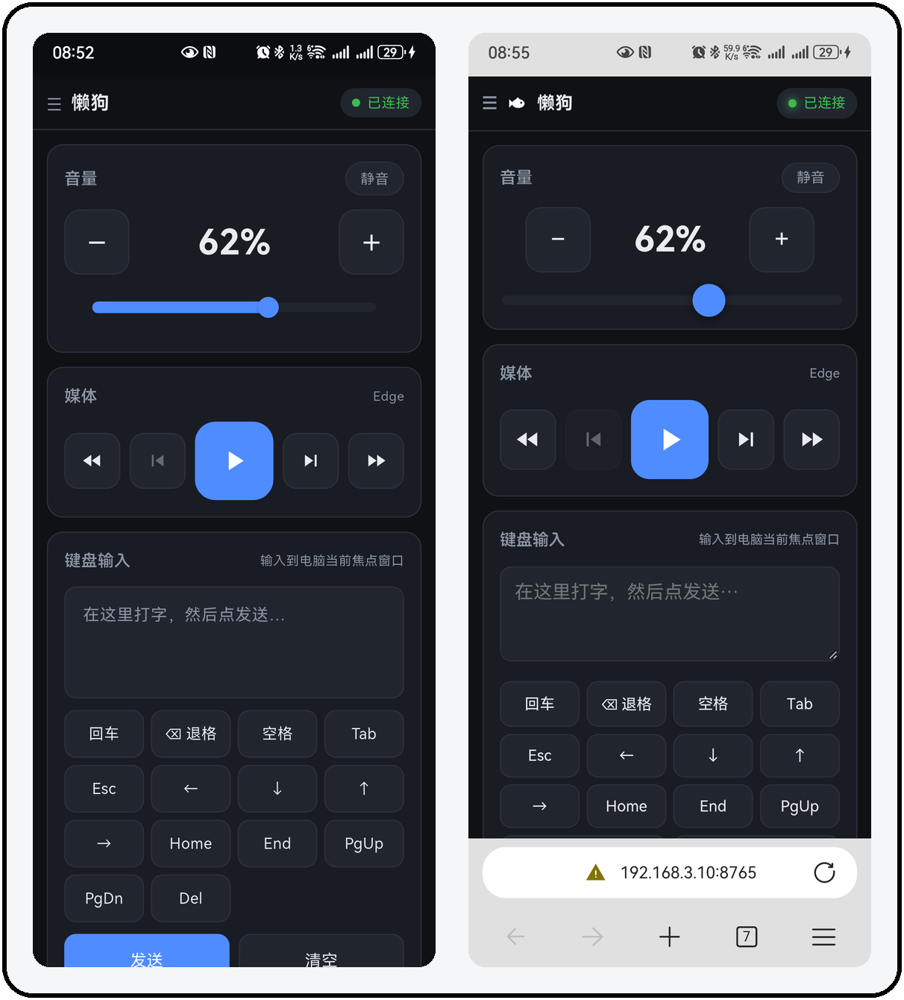
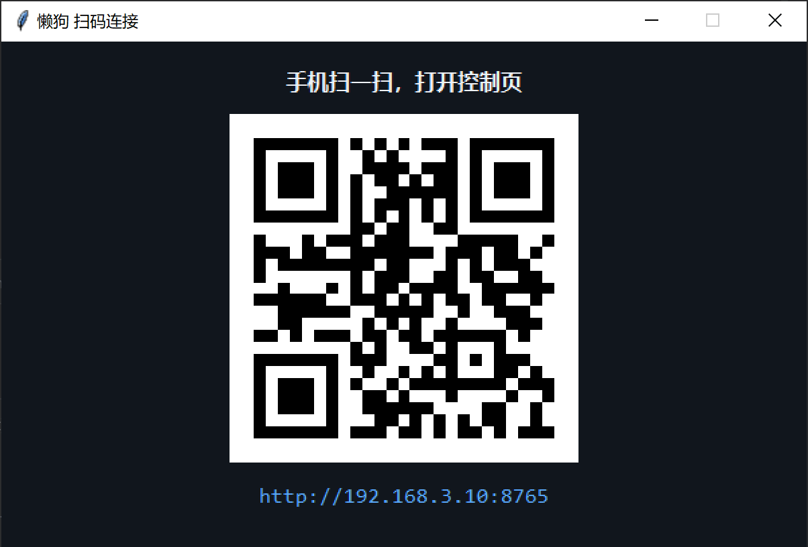
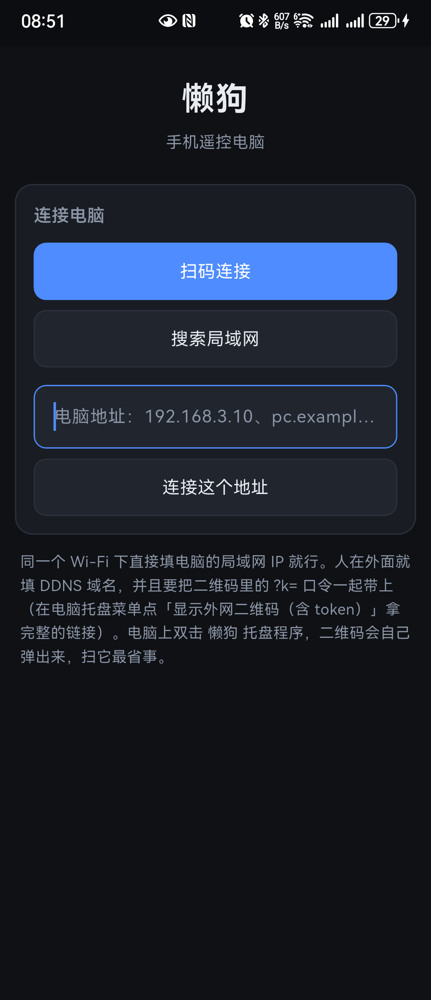
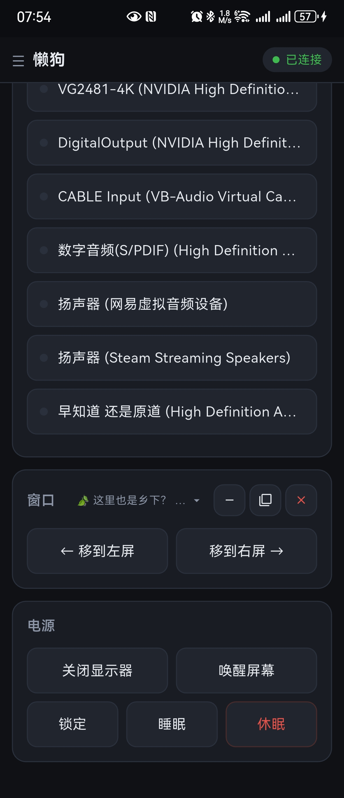
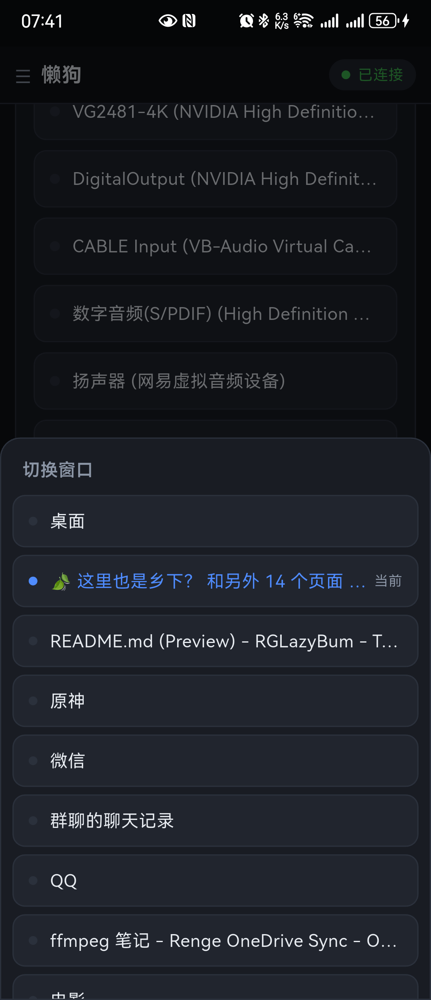
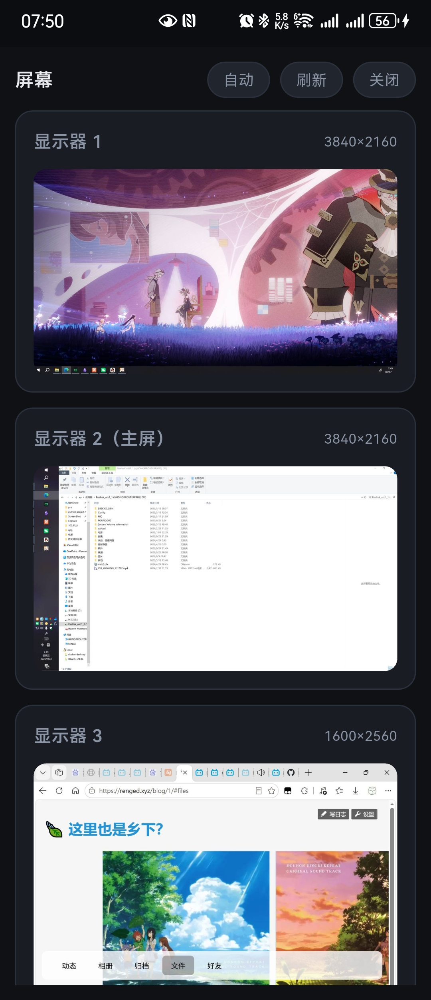
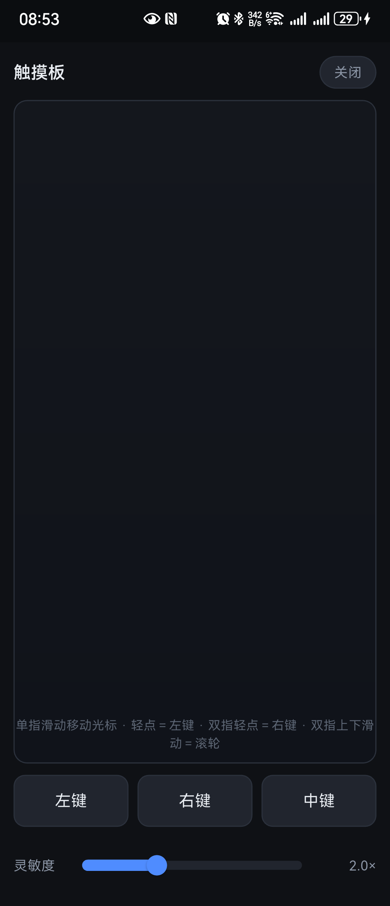

# 懒狗（RGLazyBum）

用手机遥控电脑：鼠标、键盘、媒体、音量、屏幕、电源，一个网页或一个 App 全搞定。

电脑上跑一个托盘小程序，手机连同一个 Wi-Fi 扫个码就能用，不用装驱动、不用登账号、不经过任何服务器 —— 指令只在你自己的局域网里跑。

<p align="center">
  
</p>

> 仓库名 / 可执行文件叫 `RGLazyBum`，程序在各个界面里显示的名字是「懒狗」，两个是同一个东西。

---

## 用在什么场景

这些场景都挺常见，共同点是「人不在键盘前面，但又不想走到电脑跟前」：

| 场景 | 你会用到 |
| --- | --- |
| **电脑接电视 / 投影当播放器** | 躺沙发上切歌、调音量、暂停、快进 10 秒，不用摸键盘 |
| **远程下载机 / 挂机机器** | 机器在书房或阳台，睡前用手机把它关屏、静音、锁屏、睡眠 |
| **直播 / 录屏时** | 画面在显示器上，人在别处，用手机换音频输出设备、切窗口到副屏 |
| **演示 / 会议** | 手机当翻页器和遥控，顺手把声音路由切到投影的 HDMI |
| **多显示器 + 沙发办公** | 鼠标够不到第二块屏，用手机把当前窗口一键「移到右屏」 |
| **电脑放在另一间屋，只是想看一眼** | 手机上看屏幕截图，确认它没死、没弹窗 |
| **人在外面想连回家里电脑** | 打开 IPv6 外网访问，配好 DDNS，用域名或 IPv6 地址连回来（要口令） |

它不做的事：不传文件、不远程桌面、不做账号体系。就是个「手边没有键鼠时的临时遥控器」。

---

## 功能一览

**触摸板** — 单指滑动移动光标，轻点＝左键，双指轻点＝右键，双指上下滑＝滚轮，灵敏度可调。

**键盘输入** — 手机上打字发送到电脑当前焦点窗口，支持中文和 emoji；另有回车、退格、空格、Tab、Esc、方向键、Home/End/PgUp/PgDn/Del 等常用键。

**媒体控制** — 播放/暂停、上一首/下一首、快退/快进 10 秒。会显示当前被控制的是哪个播放器（Edge、网易云音乐……），并且**按播放器的实际能力置灰按键**：网易云音乐没实现跳转位置，快退/快进就是灰的；Edge 里放单个视频时无处切歌，上一首/下一首就是灰的。播放状态跟着电脑走 —— 在电脑上手动暂停，手机上也会变。

**音量与音频输出** — 音量加减、一键静音；列出所有音频输出设备，点一下就把系统默认输出切过去，正在放的声音立刻改道。

**屏幕** — 一块显示器一个模块，点「刷新」重新抓图，也可以开自动刷新（外网慎用，费流量）。

**窗口** — 把当前活动窗口移到左屏 / 右屏。卡片标题栏显示电脑当前前台窗口的标题，点它弹出气泡，里面是按前后顺序排好的所有窗口，点谁就切到谁；列表第一行固定是「桌面」，点它把所有窗口最小化。标题右边三个小键照着 Windows 标题栏做的 —— 最小化、最大化／还原、关闭（关闭会先问一句，免得手滑），作用对象都是电脑上当前那个前台窗口。

**电源** — 关闭显示器、唤醒屏幕、锁定、睡眠、休眠。关屏后电脑照常运行，媒体键、鼠标、打字都还能用。

**三种连法** — 扫码（最快）、搜局域网（二维码找不到了）、手填地址（局域网 IP、外网域名、IPv6 地址都认，IPv4/IPv6/域名通吃）。连成功过的地址会记住，下次自动填回输入框。

**两套客户端** — 手机浏览器直接打开网页就能用，不用装 App；安卓也有原生 App，体验更顺（触摸板跟手、可以常驻）。

---

## 界面截图

| 电脑端二维码窗口 | 安卓 · 连接页 |
| --- | --- |
|  |  |

| 安卓 · 音频输出 / 窗口 / 电源 |  安卓 · 切换窗口 |
| --- | --- |
|  |  |

| 安卓 · 屏幕 | 安卓 · 触摸板 |
| --- | --- |
|  |  |

---

## 下载安装

到 [Releases](https://github.com/RengeRenge/RGLazyBum/releases) 下载对应平台的文件，解压或安装就能用，不需要自己构建：

| 你的设备 | 下载哪个 | 怎么用 |
| --- | --- | --- |
| Windows 10/11 电脑 | `RGLazyBum-v1.1.1-win-x64.zip` | 解压到任意目录，双击里面的 `RGLazyBum.exe` |
| 安卓手机 | `RGLazyBum-v1.1.0-android.apk` | 传到手机装上；第一次扫码会要相机权限（安卓端本版无改动，沿用 v1.1.0） |
| iPhone | 没有现成的 | 需要在 Mac 上用 Xcode 自己构建，见 [从源码构建 → iOS App](#ios-app) |
| 任意手机（不想装 App） | 什么都不用下 | 手机浏览器打开 `http://<电脑局域网IP>:<端口>` 就是完整界面 |

三点注意：

- 电脑端解压后**整个文件夹要一起留着**，`RGLazyBum.exe` 不要单独挪出去（程序依赖同目录下的 `_internal`）。
- 第一次运行会弹一次 Windows 防火墙授权，**点「允许」**，不然手机连不上。托盘图标显示为黄色时就是这个原因，在托盘菜单里点一下防火墙那一项也能补上。
- 程序没有安装过程，`RGLazyBum.exe` 直接跑、托盘菜单里选「退出」就结束；想开机自启，托盘菜单里打勾即可。

装好之后怎么用，见下一节。

---

## 使用方法

两步：电脑端把服务跑起来，手机连上来。**两端要在同一个局域网（同一路由器 / 同一 Wi-Fi）。**

### 电脑端

跑起来之后，托盘里会出现一个小鱼图标，**双击它就是二维码窗口**，右键出菜单。

托盘图标四种颜色，一眼看出状态：

| 颜色 | 含义 |
| --- | --- |
| 🔵 蓝 | 一切正常 |
| 🟡 黄 | 电脑的防火墙还没放行，手机连不上（托盘菜单里点一下就能修） |
| ⚪ 灰 | 正在启动（刚开机那一下，端口还没定下来） |
| 🔴 红 | 服务没起来（端口全被占了之类，托盘菜单里「打开日志」看原因） |

服务端口不用配：按 `8765 → 38765 → 38766 → 38767 → 38768` 的顺序自动挑第一个空闲的。托盘菜单和二维码里显示的永远是实际生效的那个。

### 手机端

- **扫码连接（推荐）**：电脑上双击托盘图标弹出二维码，用手机扫。
- **搜索局域网**：二维码找不到了，或者忘了看端口，就点这个，App 会把局域网扫一遍。
- **手填地址**：认得电脑 IP 的时候直接填，例如 `192.168.3.10`（端口可以省略，会自动按候选端口试）。

网页版不用装任何东西：手机浏览器打开 `http://<电脑局域网IP>:<端口>` 就行。

---

## 外网访问（可选）

默认只在局域网可用。想在外面也能连回来，前提是宽带有公网 IPv6（现在大多数都有）：

1. 托盘菜单里打开 **「IPv6 外网访问」**。
2. 托盘菜单里设置 **DDNS 域名**（把家里的公网 IPv6 绑到一个域名上，因为 IPv6 地址会变）。
3. 托盘菜单点 **「显示外网二维码（含 token）」**，扫它。

几点要注意：

- **外网链接必须带口令**（链接里的 `?k=xxx`）。局域网访问完全不需要口令，只有从公网 IPv6 进来的请求才要。口令存在 `%LOCALAPPDATA%\RGLazyBum\token.txt`，扫码之后手机上会种 90 天的 cookie。
- 手填地址连外网时，**要把整条带 `?k=` 的链接粘进去**，只填域名会被电脑拒掉（App 会提示你去拿带 token 的链接）。
- 光猫 / 路由器默认会拦 IPv6 入站，可能需要在路由器上放行对应 TCP 端口。
- 手机在外网能否连上，取决于手机自己有没有 IPv6：多数家庭 Wi-Fi 没有，移动数据通常有。

---

## 从源码构建

不想用现成的，想自己改、自己打，看这一节。

### 电脑端（Windows）

要求 Windows 10/11，Python 3.10+。

```bat
git clone git@github.com:RengeRenge/RGLazyBum.git
cd RGLazyBum
build.bat
```

`build.bat` 会自动建虚拟环境、装依赖、用 PyInstaller 打包，然后把 `dist\RGLazyBum\RGLazyBum.exe` 跑起来。产物是 `dist\RGLazyBum\`（onedir，不是单文件）。

```bat
build.bat            rem 打包并运行
build.bat --clean    rem 先删掉 build\ 和 dist\ 再打包
build.bat --nobuild  rem 不打包，只运行现成的 exe
```

> 为什么必须是 onedir：onefile 的引导程序每次都会把自身解压到一个随机临时目录，进程镜像路径每次都不同，Windows 防火墙的「程序型」规则永远匹配不上。onedir 在 Windows 上只有一个进程，路径稳定，防火墙规则一次加好、以后换端口都不用再管。

只想要源码模式，不打包：

```bat
start.bat
```

### 安卓 App

```bat
cd app
flutter build apk --release
```

产物：`app\build\app\outputs\flutter-apk\app-release.apk`。

装到手机：

```bat
adb install -r -d app\build\app\outputs\flutter-apk\app-release.apk
```

> 打出来的 release APK 用的是 Flutter 默认的 debug 签名，自用没问题；要正式分发给别人，自己配一份 `app\android\key.properties`。

### iOS App

iOS 只能**在 macOS 上**构建（需要 Xcode + CocoaPods），Windows 上编译不了。工程配置已经在仓库里备好：Bundle ID `com.rglazybum.rglazybumApp`、显示名「懒狗」、咸鱼图标、相机与本地网络权限说明、以及为自建 HTTP 服务放开的 ATS。

在 Mac 上：

```bash
cd app
flutter pub get

# 只是产出 .app 验证能编译（不签名）
flutter build ios --release --no-codesign

# 出 ipa，装到自己的设备/TestFlight（需要 Apple 开发者账号）
flutter build ipa --release
```

装到真机还需要：在 `app/ios/Runner.xcworkspace` 里选好你的 Team，并保证这个 Bundle ID 在你的账号下没被占用。

> 关于 ATS：电脑端是自建服务，只监听 HTTP 没有证书，所以 `Info.plist` 里放开了 `NSAllowsArbitraryLoads`。自用没问题，**要上架 App Store 得改回 `NSAllowsLocalNetworking`、并把外网访问换成 HTTPS**，否则审核过不了。

---

## 工作原理

```
手机（App 或浏览器）
      │  WebSocket，局域网内直连
      ▼
电脑上的 FastAPI 服务 ──► 单线程执行器 ──► Win32 / COM
      ▲                                    ├─ SendInput      鼠标键盘
      │                                    ├─ pycaw          音量与音频设备
   每秒轮询状态，有变化才推                    ├─ GSMTC (winsdk) 媒体会话
   分发给前端刷新界面                         ├─ GDI            屏幕截图
                                          └─ SetThreadExecutionState / 锁屏
```

几个设计取舍：

- **所有 Win32 / COM 调用都丢给一个单线程执行器**。一来保证命令严格按顺序生效（鼠标增量必须有序，否则光标会乱跳），二来让 COM 与 `SendInput` 都跑在同一个已初始化 COM 的线程里，不阻塞 asyncio 事件循环。
- **鼠标移动用「读当前位置 + 增量」算绝对坐标再注入**，绕开系统的鼠标加速，跟手。
- **状态每秒轮询、有变化才推**，手机界面和电脑的真实状态（音量、静音、媒体播放、当前播放器）不会对不上。
- **媒体控制优先走 GSMTC 直接控制当前会话**，只在没有会话时才退回系统媒体键 —— 直接用媒体键会把按键投递到非当前会话的播放器上，界面和实际就会对不上。

---

## 目录结构

```
.
├── tray.py             托盘主程序（打包入口）：菜单、四色图标、服务生命周期
├── server.py           FastAPI 服务：WebSocket 指令分发、外网口令准入
├── settings.py         可配置项（IPv6 开关、DDNS 域名），存 %LOCALAPPDATA%\RGLazyBum\config.json
├── wininput.py         鼠标 / 键盘 / 窗口移动（SendInput）
├── audiocontrol.py     音量、静音、音频输出设备（pycaw）
├── mediacontrol.py     媒体会话读取与控制（GSMTC / winsdk）
├── screenshot.py       多显示器截图（GDI）
├── power.py            关屏 / 唤醒 / 锁定 / 睡眠 / 休眠
├── netinfo.py          本机局域网地址、公网 IPv6
├── firewall.py         Windows 防火墙规则的检测与添加
├── autostart.py        开机自启（注册表 Run 项）
├── qrwin.py            二维码窗口（独立 Tk 线程）
├── applog.py           日志（%LOCALAPPDATA%\RGLazyBum\logs\rglazybum.log）
├── web/                网页版界面（index.html / app.js / style.css）
├── app/                安卓 + iOS 客户端（Flutter）
│   └── lib/
│       ├── core/       连接、端点解析与探测、局域网扫描
│       └── ui/         连接页、控制页、触摸板、屏幕、帮助
├── docs/screenshots/   README 用的截图
├── RGLazyBum.spec      PyInstaller 打包规格
├── build.bat           建环境 + 打包 + 运行
├── start.bat           源码模式运行
└── requirements.txt
```

---

## 常见问题

**手机上显示连上了，但按钮按下去没反应**
多半是电脑的防火墙没放行。看托盘图标颜色，黄色就是防火墙问题，托盘菜单里点一下即可。

**托盘图标是黄色的**
防火墙状态检测只在服务绑定端口时做一次，Windows 防火墙服务没就绪时会误判；程序会自动重试 3 次。还不行就在托盘菜单里手动点一下防火墙那一项。

**媒体键按了没反应，或者控制的是别的播放器**
Windows 的 GSMTC 只登记"活着"的媒体会话，播放器暂停久了会话会过期，这时会退回系统媒体键。播放器暂停后重新播放一般就能恢复。

**换了个端口之后手机连不上了**
防火墙规则是**程序型**的（绑 exe 路径，不绑端口），所以换端口不受影响。连不上大概率是手机还记着旧端口 —— App 里点「搜索局域网」或者「连接设置 → 换一台电脑」重连一次。

**电脑睡眠/休眠之后连不上了**
服务跟着系统一起挂起了，需要用开机卡或电源键唤醒，唤醒后手机会自动重连。

**锁屏之后鼠标键盘都不动了**
Windows 会拦截锁屏状态下的模拟输入，这是系统安全机制，绕不过去。

---

## 安全说明

- 指令只在你的局域网内传输，**不经过任何第三方服务器**。
- 局域网访问**不需要口令**；只有来源是公网 IPv6 的请求才要求口令（存在 `token.txt`，扫码后种 90 天 cookie）。
- 服务监听 `0.0.0.0` 和 `[::]`，也就是说同一局域网内任何设备都能访问（这是"扫码即用"的代价）。**在不可信的公共 Wi-Fi 下建议退出程序**。
- 电脑端只提供 HTTP，没有 HTTPS。走公网时的安全性依赖于 IPv6 地址的不易猜测和口令本身，别把它当成堡垒机用。

---

## 已知限制

- 只支持 Windows（依赖 Win32 / COM / GSMTC）。
- 屏幕画面是整屏截图传输，外网下比较费流量，别一直开着自动刷新。
- 锁屏状态下无法模拟键鼠输入。
- 睡眠 / 休眠后无法远程唤醒，需要通电的唤醒方式（开机卡 / 电源键 / Wake-on-LAN 之类）。

---

## 许可证

[MIT](LICENSE)
